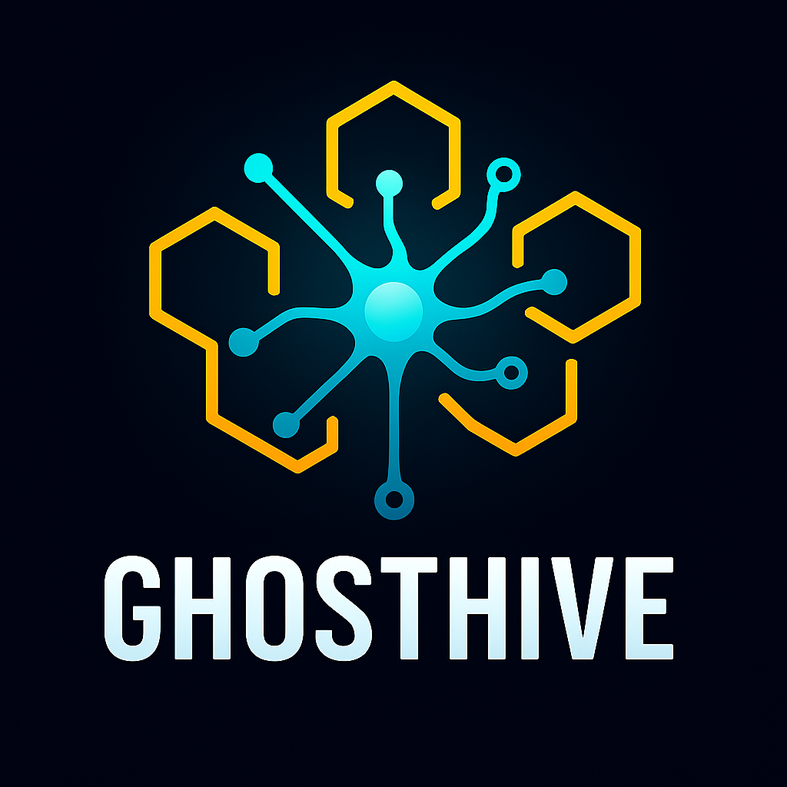

<div align="center">
  
</div>

<div align="center">
  <a href="https://ziglang.org"></a>
  <a href="https://ziglang.org/download"></a>
  <a href="https://developer.nvidia.com/cuda-toolkit"></a>
  <a href="https://developer.nvidia.com/tensorrt"></a>
  <a href="https://arxiv.org/abs/1412.6980"></a>
  <a href="https://developer.nvidia.com/cuda-toolkit"></a>
</div>

# GhostHive - Machine Learning Framework

A Zig-based machine learning framework for neural networks, training, and inference.

## Features

- N-dimensional tensor operations (add, sub, mul, square, sum) with broadcasting
- Matrix operations (transpose, matmul)
- Neural network layers (Linear) with Adam optimizer
- Activation functions (ReLU, Sigmoid)
- Loss functions (MSE)
- Basic training with Adam

## Zig Integration 
```bash
zig fetch --save https://github.com/ghostkellz/ghostmind/archive/refs/heads/main.tar.gz

```
## Usage

```zig
const std = @import("std");
const ghosthive = @import("ghosthive");

pub fn main() !void {
    const allocator = std.heap.page_allocator;
    var x = try ghosthive.Tensor.init(allocator, &[_]usize{4, 1});
    defer x.deinit();
    // ... set data
    var y = try ghosthive.Tensor.init(allocator, &[_]usize{4, 1});
    defer y.deinit();
    // ... set targets
    var layer = try ghosthive.Linear.init(allocator, 1, 1);
    defer layer.deinit();
    try ghosthive.trainLinear(allocator, &layer, &x, &y, 0.01, 100);
}
```
## Building

Run `zig build` to build the project.

Run `zig build test` to run tests.

Run `zig build run` to see a linear regression demo with Adam.

## Documentation

See [docs/](docs/) for API reference and examples.
